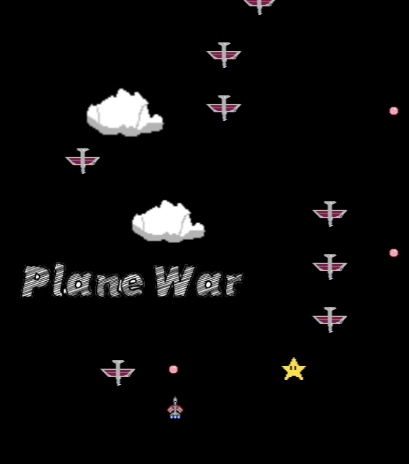

<h1><strong>Shoot 'em up(STG)Game-PlaneWar</strong></h1>

<h4>💬Story background & Description</h4>
PlaneWar is a classic shooting game in which the player takes the role of a pilot and fights in the air aboard a fighter jet to defend the land against the formidable air power of the enemy. This aerial war will test every pilot's skill, courage, and loyalty. In the game, you must dodge enemy planes while using your weapons to attack them, shoot them down, and protect your fighter from being hit. 
  
The gameplay of PlaneWar is simple and intuitive, but as the number of shoot-downs increases, the game becomes more challenging. The game was so popular that it became part of many players' childhood memories. Now, we are waiting for you to join the military conflict in the air, become the most excellent pilot to fight over an evil army, and save the world! 

<h2>⚠️warning⚠️</h2>
<ul>
<li> Running platform: Windows OS </li>
<li> The equipment needs to use: a mouse </li>
<li> PlaneWar is an aircraft war game written in the Java programming language</li>
<li> This stage is source code, not yet packaged and exported </li>
<li> You can choose to run the game in two different ways：
<ol><li>Download file<strong> "planeWar1 eng-ver 1.0.zip"</strong>and unzip it,Open the Java IDE (such as Eclipse) and import "planeWar1 eng-ver 1.0" directory,open <strong>'GameWin.Java'</strong> and run the program. </li>
<li>Download file<strong> "planeWar1.0 (JAR) "and unzip it,</strong>Go to the directory folder and double-click <strong>"planeWar.jar"</strong></li></ol></li>

</ul>

<h3>How to play❓🖱️</h3>
<ul>
  <li> After opening the game, the home page will display "Click to Start", click the left mouse button to start the game</li>
  <li> Move the mouse to control the fighter to defeat the enemy and the boss</li>
  <li>  The current score is displayed in the upper left corner  </li>
 </ul>
 
 
 
 </ol>
 <h2>Demostration(eclipse)</h2>
 
URL:

 <li> <a href="https://www.youtube.com/watch?v=0_rIfyrRUVQ">https://www.youtube.com/watch?v=0_rIfyrRUVQ</a>(eclipse installation tutorial)</li>
 <li> <a href="https://youtu.be/uPLA_M6wgiE">https://youtu.be/uPLA_M6wgiE</a>(eclipse tutorial)</li>
 <li> <a href="https://youtube.com/shorts/voTdYVR-08U?feature=share">https://youtube.com/shorts/voTdYVR-08U?feature=share</a>(gameplay demo)</li>
</ol>

<ul>
<h2>Declaration</h2>
  <li>all of the in-game object images(execpt boss fighter) are made by Bob Hon using <a href="https://www.pixilart.com/">pixilart.com</a></li>
  <li>boss fighter images is made by Gary using <a href="https://www.pixilart.com/](https://www.gaituya.com/aiimg/">https://www.gaituya.com/aiimg/</a></li>
</ul>

<h2>Purpose of this Software</h2>

  
Our group has decided this project is time-to-market because the content of our software could be more memorable. Furthermore, our development time is limited, so we must publish as soon as possible. The development process is trending toward the agile side for strategic fit because a runnable program is more important than a full version or quality-based software. Therefore, we have made a short-term version first and will get an update after. At last, version 1.0 is our final product. We are aiming for the game industry as our target market. If we are developing in a fundamental business matter, we may plan a beta test for customers and then get feedback for upgrading.

<h2>Software development plan</h2>
<ol>
  
<li>   <strong>Game concept design:</strong> In this stage, we must discuss the basic gameplay, content, level design, game rules, etc. We must also decide on the game's style, theme, and target audience.  </li>
   
  
  <li><strong>Game design:</strong> In this stage, we must design the game's gameplay, enemy, player combat, and level details. We must consider game difficulty, balance, and pacing factors and optimize the gaming experience.</li>
   
  
  <li>  <strong>Programming:</strong> In this stage, we must decide which programming language to use and write the game's code. Programmers must create game objects, characters, scenes, UI, etc., and implement all the features in the game design. During this stage, multiple tests and debugging are required.  </li>
   
  
  <li> <strong>Art design:</strong> In this stage, we must create the game's art assets, including player and enemy combat vehicle models and scene design. We must consider the game's style and theme, creating a pleasing gaming experience. Some art design software, such as Photoshop and Maya, will be needed at this stage.
   </li> 
  
  <li>   <strong>Testing and optimization:</strong> In this stage, we must conduct multiple tests and optimizations to ensure the game's stability and smoothness. We must fix all errors and bugs and optimize the game's performance and user experience. </li>
    
  <li>  <strong>Programming:</strong> Same as process three but just for adding a new feature.  </li>
   
  
  <li> <strong>Art design:</strong> Art design for the updated program.
   </li> 
  
  <li> <strong>Testing and optimization:</strong> In this stage, we must fix all errors and bugs and optimize the game's performance and user experience.</li> 
  
 <li> We have continued the same process until version 1.0 is finished.</li>
 
</ol>  
 
<ul>
  <li>Roles & Responsibilities & Portion</li>
  

      
   
    p2104747-Bob:
    -Programming
    -Direction discussion
    -graphic design
    
    p2104308-Johnny:
    -Data Collection
    -Direction discussion
    -Bug fixing
    
    p2104581-GaryLei:
    -Programming
    -Direction discussion
    -Bug fixing
    
    p2104780-Tobias:
    -Programming
    -Direction discussion
    -System testing
    
    p2104621-GaryLeong:
    -System testing
    -Data Collection
    -Direction discussion
   
  

    
</ul>
    
  
  <li>Schedule/ Development log</li>
  <ul>
    <li>15/02/2023: Project start. Designed the general development direction of the game.</li>
    <li>22/02/2023: Summarize the collected data and discuss the main components appearing on the stage.</li>
    <li>26/02/2023: Design for the player-controlled plane movement and the system</li>
    <li>28/02/2023: Bug fixing and system testing</li>
    <li>01/03/2023: Bug fixing and system testing</li>
    <li>08/03/2023: Design enemies objects and user-plane bullets</li>
    <li>09/03/2023: Bug fixing and system testing</li>
    <li>15/03/2023: Boss movement design</li>
    <li>22/03/2023: Applied the enemy boss object</li>
    <li>26/03/2023: Bug fixing</li>
    <li>29/03/2023: Bug fixing</li>
    <li>02/04/2023: add background objects</li>
    <li>09/04/2023: add boss shooting feature</li>
    <li>13/04/2023: bug fixing</li>
  </ul>
    
  
  
  <li>Current status</li>
  
Still, some bugs appeared, but critical bugs are fixed, ver 1.0 can run smoothly.

    
  
  
  <li>Future Plan</li>
  <ol>
  <li><strong>Diverse fighter jets:</strong> The game offers a variety of unique fighter jets for players to choose from. From high-speed maneuverable fighters to heavy bombers, each fighter jet has outstanding performance and weapon systems, allowing players to experience different flying combat styles.</li> 
  <li><strong>Rich levels and enemies:</strong> The game has designed multiple challenging levels, where players must fight under various terrains and weather conditions and face different types of enemy planes, ground defense facilities, and powerful boss characters.</li> 
  <li><strong>Upgrades and customization:</strong> By shooting down enemy planes and completing missions, players can obtain resources and experience points to upgrade the performance, weapons, and skills of their fighter jets. They can even customize the appearance of their fighter jets to create their exclusive combat aircraft.</li> 
  <li><strong>Multiplayer cooperative mode:</strong> The game supports a suitable multiplayer mode. Players can form teams with friends to challenge difficult levels and support each other on the battlefield.</li> 
  <li><strong>BGM:</strong> We plan to add music to this game in the future. Each level will have different music. We will also add music for boss battles.</li>
  </ol>
</ul>
  
