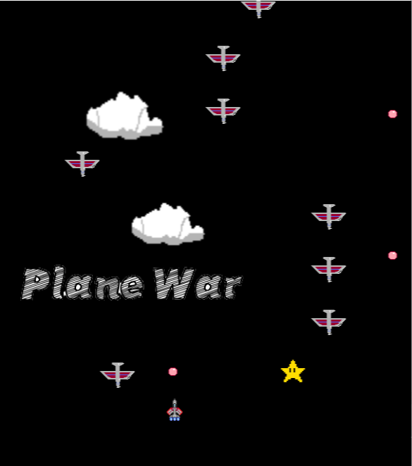

<h1><strong>Shoot 'em up(STG)Game-PlaneWar</strong></h1>

<h4>💬Story background & Description</h4>
PlaneWar is a classic shooting game in which the player takes the role of a pilot and fights in the air aboard a fighter jet to defend the land against the formidable air power of the enemy. This aerial war will test the skill, courage and loyalty of every pilot. In the game, you have to dodge enemy planes while using your weapons to attack them, shoot them down and protect your fighter from being hit. 
  
The gameplay of PlaneWar is simple and intuitive, but as the number of shoot-downs increases, the game becomes more challenging. The game was so popular that it became part of many players' childhood memories. Now, we are waiting for you to join the military conflict in the air, become the most excellent pilot to fight over a evil army and save the world! 

<h2>⚠️warning⚠️</h2>
<ul>
<li> Running platform: windows OS</li>
<li> The equipment need to use： mouse</li>
<li>PlaneWar is an aircraft war game written in the java programming language </li>
<li>This stage is source code, not yet packaged and exported </li>
<li>you can directly use a java IDE (such as eclipse) open <strong>'GameWin.Java'</strong>, run the program. </li>

</ul>

<h3>How to play❓🖱️</h3>
<ul>
  <li> After opening the game, the home page will display "Click to Start", click the left mouse button to start the game</li>
  <li> Move the mouse to control the fighter to defeat the enemy and the boss</li>
  <li>  The current score is displayed in the upper left corner  </li>
 </ul>
 
 
 
 </ol>
 <h2>Demostration(eclipse)</h2>
 
URL:

 <li> <a href="https://www.youtube.com/watch?v=0_rIfyrRUVQ">https://www.youtube.com/watch?v=0_rIfyrRUVQ</a>(eclipse installation tutorial)</li>
 <li> <a href="https://youtu.be/uPLA_M6wgiE">https://youtu.be/uPLA_M6wgiE</a>(eclipse tutorial)</li>
 <li> <a href="https://youtube.com/shorts/_A_bz6G-pqQ?feature=share">https://youtube.com/shorts/_A_bz6G-pqQ?feature=share</a>(gameplay demo)</li>
</ol>

<h2>Purpose of this Software</h2>

  
our group decide this project as time-to-market 

<h2>Software development plan</h2>

  
  
  <li>Schedule/ Development log</li>
  <ul>
    <li>15/02/2023: Project start. Designed the general development direction of the game.</li>
    <li>22/02/2023: Summarize the collected data and discuss the main components that would appear on the stage.</li>
    <li>26/02/2023: Design for the player-controlled plane movement and the system</li>
    <li>28/02/2023: Bug fixing and system testing</li>
    <li>01/03/2023: Bug fixing and system testing</li>
    <li>08/03/2023: Design enemies objects and user-plane bullets</li>
    <li>09/03/2023: Bug fixing and system testing</li>
    <li>15/03/2023: Boss movement design</li>
    <li>22/03/2023: Applied the enemy boss object</li>
    <li>26/03/2023: Bug fixing</li>
    <li>29/03/2023: Bug fixing</li>
    <li>02/04/2023: add background objects</li>
    <li>09/04/2023: add boss shoting feature</li>
    <li>13/04/2023: bug fixing</li>
  </ul>
    
  
  
  <li>Current status</li>
  
Still some bugs appeared, but critical bugs are fixed, ver 1.0 can run smoothly

    
  
  
  <li>Future Plan</li>
  <ol>
  <li>Diverse fighter jets: The game offers a variety of unique fighter jets for players to choose from. From high-speed maneuverable fighters to heavy bombers, each fighter jet has its unique performance and weapon system, allowing players to experience different flying combat styles.</li> 
  <li>Rich levels and enemies: The game has designed multiple challenging levels, where players need to fight under various terrains and weather conditions, and face different types of enemy planes, ground defense facilities, and powerful boss characters.</li> 
  <li>Upgrades and customization: By shooting down enemy planes and completing missions, players can obtain resources and experience points to upgrade the performance, weapons, and skills of their fighter jets. They can even customize the appearance of their fighter jets to create their own exclusive combat aircraft.</li> 
  <li>Multiplayer cooperative mode: The game supports multiplayer cooperative mode. Players can form teams with friends to challenge difficult levels together and support each other on the battlefield.</li> 
  <li>BGM: we plan to add music to this game in the future. Each level will have different music. If feasible, we will also add music for boss battles.</li>
  </ol>
</ul>
  
